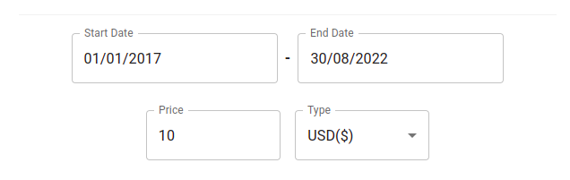
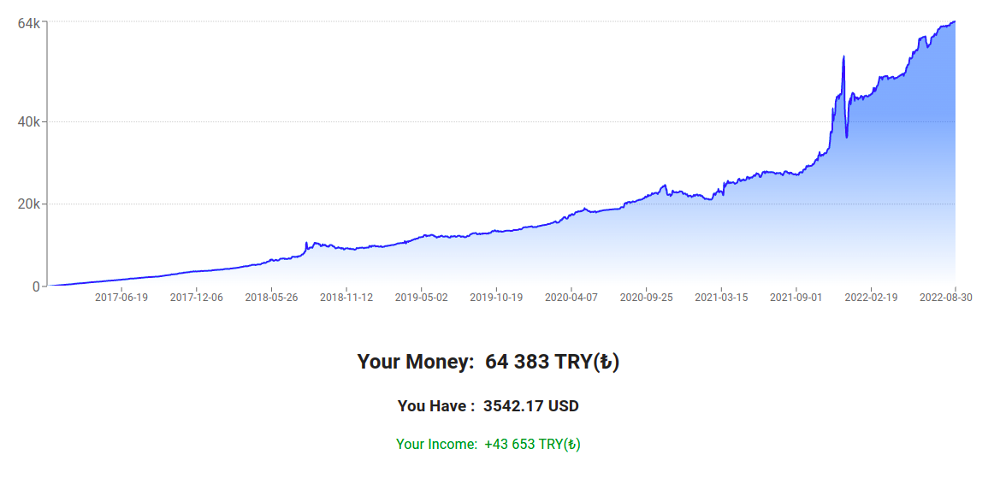

# The biggest regret app

> ### Go App: &nbsp; https://hmtcelik.github.io/olsaydi/

 

Olsaydi is a regret app, which show you if you fill these areas:
- start date
- end date
- currency (now only USD and EUR)
- price (how much)

## (Sample):

## This fields shows:

- if you buy USD which equal 10 TRY every day, what will be your money at today?  :d

 

# Results:

Results show your money and how much get without your base money

(which is 'Your Income' at the bottom)

 

>## In the Future
> Will add many calculation like this:
> - for gold, or other precious metals
> - not just TRY, will add all units
> - and others...